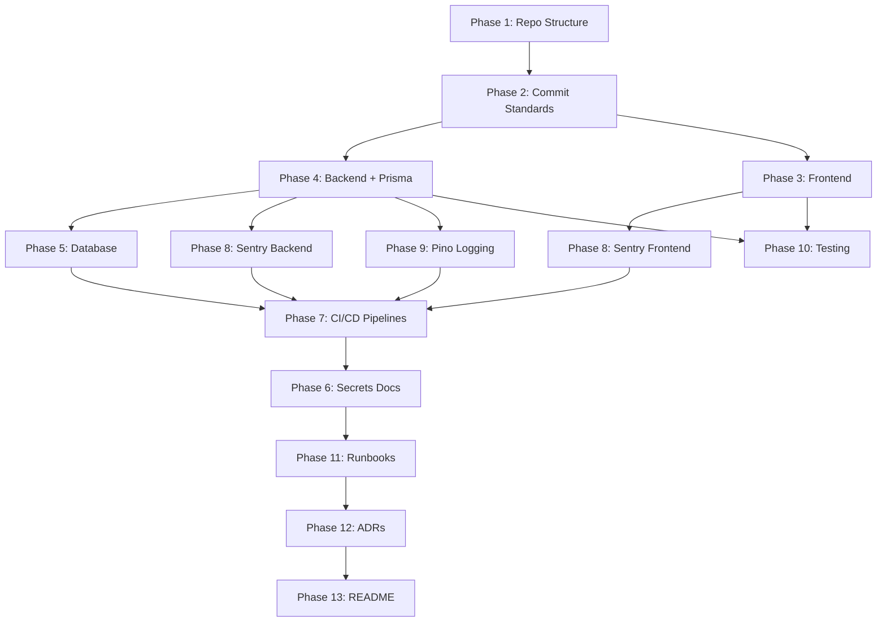

# Full-Stack Project Foundation — Implementation Plan

## Goal

Scaffold a complete, production-oriented software delivery system from day one using **exclusively free tier services**. Every feature will be developed, tested, deployed, monitored, and maintained the way a professional team would.

---

## User Review Required

> [!IMPORTANT]
> **Project Name & Domain**: I'll need a project name to use for the repository, Vercel project, Render services, etc. For now I'll use the placeholder `fullstack-foundation` — let me know if you want something different.

> [!WARNING]
> **Render Free DB Expires in 30 Days**: Render's free PostgreSQL databases expire after 30 days. I recommend using **Neon** instead for the database (persistent free tier, 0.5 GB storage, no expiration). See the comparison table below.

> [!IMPORTANT]
> **Backend Hosting Choice**: Render's free web services spin down after 15 min of inactivity (30-60s cold start). An alternative is **Northflank** (always-on, no cold starts, 2 free services + 1 free DB). However, Northflank requires a credit card for verification. See comparison below.

---

## Free Tier Service Comparison (June 2026)

### Database

| Provider | Storage | Expiration | Cold Start | Credit Card |
|:---------|:--------|:-----------|:-----------|:------------|
| **Neon** (recommended) | 0.5 GB/project | **Never** | Scales to zero after 5 min | No |
| Render | 1 GB | **30 days** | N/A | No |
| Supabase | 500 MB | Never (pauses after 7 days inactivity) | Yes | No |

### Backend Hosting

| Provider | Always-on | Cold Start | Free Services | Credit Card |
|:---------|:----------|:-----------|:--------------|:------------|
| **Render** (recommended) | No | 30-60s after 15 min idle | Unlimited | No |
| Northflank | Yes | None | 2 services + 1 DB | Yes |

### Full Stack

| Service | Free Tier Limit | Purpose |
|:--------|:----------------|:--------|
| **GitHub** (Free) | Unlimited public repos, 2000 CI min/mo | Repository + CI/CD |
| **Vercel** (Hobby) | 100 GB bandwidth, 1M function invocations | Frontend hosting |
| **Render** (Free) | Spin-down after 15 min | Backend hosting |
| **Neon** (Free) | 0.5 GB, 100 CU-hours/mo | PostgreSQL (staging + prod) |
| **Sentry** (Developer) | 5K errors, 10K perf units/mo | Monitoring |

---

## Open Questions

> [!IMPORTANT]
> **1. What application will you build?** The delivery system is framework-agnostic, but I need to know the domain to create a meaningful initial schema and API. If you don't have one yet, I'll scaffold a generic "Task Management" app with users + tasks — enough to exercise every piece of the pipeline.

> [!IMPORTANT]
> **2. Backend framework preference?** Your plan mentions a Node.js backend on Render. I'll use **Express.js + TypeScript** unless you prefer something else (Fastify, Hono, NestJS, etc.).

> [!IMPORTANT]
> **3. Database provider**: Do you agree with **Neon** over Render PostgreSQL (persistent free tier, no 30-day expiration)?

> [!IMPORTANT]
> **4. Private or public repo?** Public repos get unlimited GitHub Actions minutes. Private repos are capped at 2,000 min/mo (still generous). This affects CI costs.

---

## Proposed Changes

The implementation is organized into **13 phases**, matching your plan exactly. I'll scaffold everything locally, create all config files, CI workflows, and documentation — ready to `git push`.

---

### Phase 1 — Repository & Project Structure

#### [NEW] Project root scaffolding

```text
fullstack-foundation/
├── frontend/                    # Next.js app
├── backend/                     # Express + TypeScript API
├── docs/
│   ├── adr/                     # Architecture Decision Records
│   └── runbooks/                # Operational runbooks
├── .github/
│   └── workflows/               # CI/CD pipelines
├── .gitignore
├── .commitlintrc.json           # Conventional commit enforcement
├── README.md
└── package.json                 # Root workspace (for shared tooling)
```

**Steps:**
1. Create the directory structure
2. Initialize Git repo with `main` and `staging` branches
3. Set up `.gitignore` for Node.js, Next.js, and environment files
4. Create root `package.json` with workspace configuration

---

### Phase 2 — Commit Standards

#### [NEW] `.commitlintrc.json`
Enforce Conventional Commits using `commitlint` + `husky` pre-commit hooks.

#### [NEW] `.husky/commit-msg`
Git hook that runs commitlint on every commit.

**Steps:**
1. Install `@commitlint/cli`, `@commitlint/config-conventional`, `husky`
2. Configure commitlint rules
3. Initialize husky and add commit-msg hook
4. Add lint-staged for pre-commit formatting

---

### Phase 3 — Frontend (Next.js)

#### [NEW] `frontend/` — Next.js application

**Steps:**
1. Initialize Next.js with TypeScript via `npx create-next-app@latest`
2. Configure ESLint + Prettier
3. Set up environment variable files (`.env.local`, `.env.staging`, `.env.production`)
4. Add Sentry SDK (`@sentry/nextjs`)
5. Create a basic layout with a health check page
6. Configure `next.config.js` for Sentry source maps

---

### Phase 4 — Backend (Express + TypeScript)

#### [NEW] `backend/` — Express API

```text
backend/
├── src/
│   ├── index.ts                 # Entry point
│   ├── app.ts                   # Express app setup
│   ├── routes/                  # Route handlers
│   ├── middleware/               # Auth, error handling, logging
│   ├── services/                # Business logic
│   ├── lib/
│   │   ├── logger.ts            # Pino structured logger
│   │   ├── prisma.ts            # Prisma client singleton
│   │   └── sentry.ts            # Sentry initialization
│   └── types/                   # TypeScript types
├── prisma/
│   ├── schema.prisma            # Database schema
│   └── migrations/              # Migration files
├── tests/
│   ├── unit/                    # Vitest unit tests
│   └── integration/             # Vitest integration tests
├── tsconfig.json
├── package.json
├── Dockerfile                   # For Render deployment
└── .env.example
```

**Steps:**
1. Initialize Node.js project with TypeScript
2. Install Express, Pino, Prisma, Sentry, Vitest
3. Create structured logger with Pino (JSON output)
4. Set up Prisma with initial schema (User model)
5. Create health check endpoint (`GET /health`)
6. Set up error handling middleware with Sentry integration
7. Add request logging middleware
8. Create Dockerfile for Render

---

### Phase 5 — Database (Neon PostgreSQL + Prisma)

#### [NEW] `backend/prisma/schema.prisma`

Initial schema with a `User` model to exercise the full pipeline.

**Steps:**
1. Sign up for Neon (https://neon.tech) — create 2 projects:
   - `fullstack-staging`
   - `fullstack-production`
2. Copy connection strings for each
3. Configure Prisma schema
4. Create initial migration: `npx prisma migrate dev --name init`
5. Document migration workflow in runbooks

**Migration workflow (automated in CI):**
```text
Schema change → prisma migrate dev → commit migration → CI validates → deploy → prisma migrate deploy
```

---

### Phase 6 — Environment & Secrets Management

#### [NEW] Environment variable templates

**Steps:**
1. Create `.env.example` files in `frontend/` and `backend/`
2. Document all required variables:
   ```
   DATABASE_URL=
   JWT_SECRET=
   SENTRY_DSN=
   NODE_ENV=
   ```
3. Set up GitHub Secrets (manual — documented in README):
   - `DATABASE_URL_STAGING`
   - `DATABASE_URL_PRODUCTION`
   - `SENTRY_DSN`
   - `JWT_SECRET_STAGING`
   - `JWT_SECRET_PRODUCTION`
   - `RENDER_API_KEY`
   - `VERCEL_TOKEN`
4. Set up Vercel environment variables (manual — documented)
5. Set up Render environment variables (manual — documented)

---

### Phase 7 — CI/CD Pipelines (GitHub Actions)

#### [NEW] `.github/workflows/ci.yml` — Pull Request Checks

Triggered on PRs to `staging` and `main`:
```yaml
- Checkout code
- Install dependencies
- Run ESLint (frontend + backend)
- Run TypeScript type check (frontend + backend)
- Run unit tests (Vitest)
- Run integration tests (Vitest, with test DB)
- Build verification (next build + tsc)
```

#### [NEW] `.github/workflows/deploy-staging.yml` — Staging Deployment

Triggered on push to `staging`:
```yaml
- Run full CI
- Deploy frontend to Vercel (staging)
- Deploy backend to Render (staging)
- Run database migrations (staging)
- Notify Sentry of new release
```

#### [NEW] `.github/workflows/deploy-production.yml` — Production Deployment

Triggered on push to `main`:
```yaml
- Run full CI
- Deploy frontend to Vercel (production)
- Deploy backend to Render (production)
- Run database migrations (production)
- Upload source maps to Sentry
- Create Sentry release
```

---

### Phase 8 — Monitoring & Observability (Sentry)

**Steps:**
1. Sign up for Sentry (https://sentry.io) — Developer plan (free)
2. Create 2 projects:
   - `fullstack-frontend` (Next.js)
   - `fullstack-backend` (Node.js)
3. Install SDKs:
   - Frontend: `@sentry/nextjs`
   - Backend: `@sentry/node`
4. Configure error tracking, performance monitoring, and distributed tracing
5. Set up source map uploads in CI

#### [NEW] `backend/src/lib/sentry.ts` — Sentry initialization
#### [MODIFY] `frontend/next.config.js` — Sentry webpack plugin
#### [NEW] `frontend/sentry.client.config.ts`
#### [NEW] `frontend/sentry.server.config.ts`

---

### Phase 9 — Structured Logging (Pino)

#### [NEW] `backend/src/lib/logger.ts`

```typescript
import pino from 'pino';

export const logger = pino({
  level: process.env.LOG_LEVEL || 'info',
  transport: process.env.NODE_ENV === 'development'
    ? { target: 'pino-pretty' }
    : undefined,
});
```

All application code will use structured logging:
```typescript
logger.info({ event: 'user_created', userId: user.id });
```

Never `console.log`.

---

### Phase 10 — Testing Strategy

#### Unit Tests (Vitest)

**Steps:**
1. Configure Vitest for both frontend and backend
2. Create sample unit tests:
   - Backend: validation logic, utility functions
   - Frontend: component rendering tests

#### Integration Tests (Vitest)

**Steps:**
1. Set up test database configuration
2. Create API integration tests (routes → database)
3. Add Prisma test utilities (seed, teardown)

#### End-to-End Tests (Playwright)

**Steps:**
1. Install Playwright
2. Configure for local and CI environments
3. Create initial E2E test: health check page loads

#### [NEW] Test configuration files:
- `backend/vitest.config.ts`
- `frontend/vitest.config.ts`
- `playwright.config.ts`

---

### Phase 11 — Rollback Strategy

#### [NEW] `docs/runbooks/frontend-rollback.md`
#### [NEW] `docs/runbooks/backend-rollback.md`
#### [NEW] `docs/runbooks/deployment-failure.md`
#### [NEW] `docs/runbooks/database-rollback.md`

Each runbook documents:
- Symptoms
- Steps to diagnose
- Steps to rollback
- Post-rollback verification

---

### Phase 12 — Architecture Decision Records

#### [NEW] `docs/adr/001-use-nextjs.md`
#### [NEW] `docs/adr/002-use-render.md`
#### [NEW] `docs/adr/003-use-postgresql.md`
#### [NEW] `docs/adr/004-use-prisma.md`
#### [NEW] `docs/adr/005-use-sentry.md`
#### [NEW] `docs/adr/006-use-neon.md`
#### [NEW] `docs/adr/007-use-pino.md`
#### [NEW] `docs/adr/008-use-vitest.md`
#### [NEW] `docs/adr/009-use-conventional-commits.md`

Each ADR follows the format:
```
# ADR-NNN: Title
## Status: Accepted
## Context (Problem)
## Options Considered
## Decision
## Tradeoffs
## Consequences
```

---

### Phase 13 — README & Setup Documentation

#### [NEW] `README.md`

Comprehensive README with:
- Project overview
- Architecture diagram (Mermaid)
- Local development setup (step-by-step)
- Environment variable reference
- Branch strategy explanation
- Deployment workflow
- Links to ADRs and runbooks

---

## Execution Order

I'll scaffold the project in this order (dependencies flow downward):



---

## Verification Plan

### Automated Tests
1. `npm run lint` — ESLint passes for frontend + backend
2. `npm run typecheck` — TypeScript compilation succeeds
3. `npm run test` — Vitest unit tests pass
4. `npx prisma validate` — Schema is valid
5. `npm run build` — Both frontend and backend build successfully
6. Dry-run CI workflow locally with `act` (optional)

### Manual Verification
1. Start local dev environment (`frontend:3000`, `backend:5000`)
2. Hit health check endpoints
3. Verify Prisma migrations run against local PostgreSQL
4. Verify commit hooks reject non-conventional commits
5. Push to GitHub and verify CI workflow triggers
6. (After external service setup) Verify Vercel preview deployments
7. (After external service setup) Verify Render deployments

---

## What I'll Build vs. What You'll Set Up Manually

| Task | Who |
|:-----|:----|
| All project files, configs, workflows, docs | **Me (scaffolding)** |
| Create GitHub repository | **You** |
| Create Neon account + databases | **You** (I'll document steps) |
| Create Vercel account + link repo | **You** (I'll document steps) |
| Create Render account + link repo | **You** (I'll document steps) |
| Create Sentry account + projects | **You** (I'll document steps) |
| Set GitHub Secrets | **You** (I'll document exactly which ones) |
| Initial `git push` | **You** |
